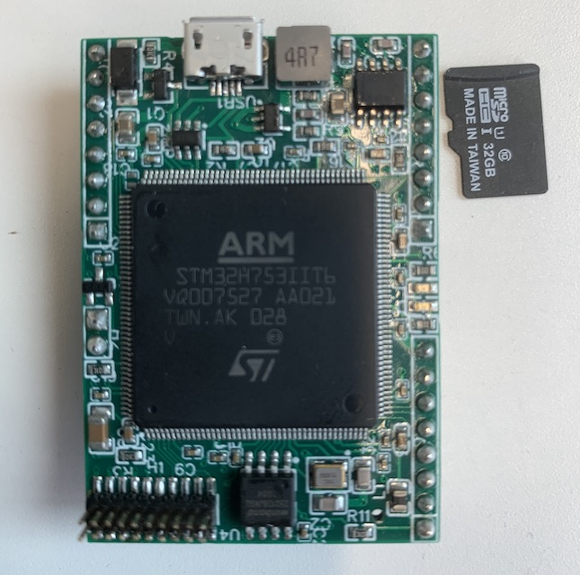

.. _iote_ai_stm32h7_board:

IOTE.AI STM32H7
###############

Overview
********

The IOTE.AI STM32H7 board, featuring a powerful ARM Cortex-M7 core,
was built as a development board for testing machine learning algorithms. Features of this
custom board:

* Powerful STM32H7 Cortex-M7 microcontroller
* MIPI20T pin headers Lauterbach trace connector
* The board can be powered via external source or USB
* USB
* QSPI flash
* CAN transceiver

